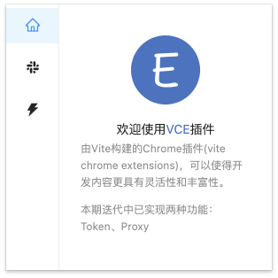

# vite-chrome-extension
又快又爽的开发 Chrome 扩展程序

### 前言
当你去写一个没有框架来支持的浏览器插件
你是不是有以下这些烦恼：😤😤😤

❌ 代码臃肿

❌ 操作DOM

❌ 好看的样式

❌ 第三方库支持

❌ 维护成本

等等一些开发中，一点都不爽的体验方式让你“笨窥”。

### 关于 Chrome 扩展程序
Chrome 扩展程序本质上只是一组可以自定义 Google Chrome 浏览器体验的文件。Chrome 扩展程序有几种不同的类型；有些在满足某个特定条件时激活。
例如：当你来到商店的结账页面时；当你点击图标时弹出；当你每次打开新标签时都会出现。
[查看更多](https://developer.chrome.com/docs/extensions/mv3/)

### 摘要
我们要把事情简单化，因此在本次文档中，我们将使用构建工具 [Vite](https://vitejs.dev/) 来帮我去完成最终的输出格式，以及使用框架来帮我们去丰富具体实现内容。因此构建 Chrome 扩展程序的构建过程是我们去完成最终的目标，具体好玩的内容可以在基础之上任意发挥。

### 使用 Vite 来构建
使用 Vite 具体要做些什么

在开发 Chrome 扩展程序 使用构建工具的目的是为了将我们所需的格式进行一个输出。

#### 1. 初始化仓库
本次介绍中，我们一贯使用了自己熟悉的 React + TypeScript 的来进行开发。

Let's go
```shell
npm init vite@latest

cd vite-project
npm install
npm run dev
```
➜  npm init vite@latest

👌 Project name: vite-project

👌 Select a framework: › react

👌 Select a variant: › react-ts

我们的目录已经生成好了

👇👇👇
```
'|-- vite-project',
'    |-- .gitignore',
'    |-- index.html',
'    |-- package-lock.json',
'    |-- package.json',
'    |-- tsconfig.json',
'    |-- vite.config.ts',
'    |-- src',
'        |-- App.css',
'        |-- App.tsx',
'        |-- favicon.svg',
'        |-- index.css',
'        |-- logo.svg',
'        |-- main.tsx',
'        |-- vite-env.d.ts',
```

#### 2. 创建 manifest.json 文件
```json
{
    "name": "Vite Chrome Extension",
    "version": "1.0",
    "manifest_version": 3, 
    "action": {
        "default_icon": {
            "16": "assets/icon16.png",
            "48": "assets/icon48.png",
            "128": "assets/icon128.png"
        },
        "default_title": "Popup",
        "default_popup": "index.html"
    }
}
```
由此看出，在`JSON`中，我们只是有一个默认的弹框和浏览器的图标的相对路径地址。
注：本次文档中使用了[Chrome V3](https://developer.chrome.com/docs/extensions/mv3/intro/) 版本

将文件放置 `src/manifes.json` 中，后面我们将使用 [Copy](https://cnpmjs.org/package/rollup-plugin-copy) 的方案进行输出。

#### 3. 创建  background.js  和 contentScript.js 文件
[background.js](https://developer.chrome.com/docs/extensions/mv2/background_pages/) 它是整个 Chrome 扩展程序中的一个运行脚本，一般用作于全局的使用。

[contentScript.js](https://developer.chrome.com/docs/extensions/mv3/content_scripts/) 它是运行在浏览器窗口，页面打开、刷新则会运行的脚本。

同样，在 `src` 目录中创建他们，后面我们将根据 Vite 选择 `Entry` 的方式进行输出。

最后再创建一个资源文件 assets

最终目录 👇👇👇
```
'|-- vite-project',
  '    |-- .gitignore',
  '    |-- index.html',
  '    |-- package-lock.json',
  '    |-- package.json',
  '    |-- tsconfig.json',
  '    |-- vite.config.ts',
  '    |-- src',
  '        |-- App.tsx',
  '        |-- background.ts', 添加background.ts
  '        |-- contentScript.ts', 添加contentScript.ts
  '        |-- index.css',
  '        |-- main.tsx',
  '        |-- manifest.json', 添加manifest.json
  '        |-- vite-env.d.ts',
  '        |-- assets', // 资源文件
```
#### 4. 安装相关依赖
```shell
npm install @types/chrome -D
npm install @types/node -D
npm install rollup-plugin-copy -D
```

#### 5. 配置 tsconfig.ts
安装依赖中的chrome类型导入到开发中。

```javascript
{
  "compilerOptions": {
    "baseUrl": "./",
    "target": "ESNext",
    "useDefineForClassFields": true,
    "lib": ["DOM", "DOM.Iterable", "ESNext"],
    "allowJs": false,
    "skipLibCheck": false,
    "esModuleInterop": false,
    "allowSyntheticDefaultImports": true,
    "strict": true,
    "forceConsistentCasingInFileNames": true,
    "module": "ESNext",
    "moduleResolution": "Node",
    "resolveJsonModule": true,
    "noEmit": true,
    "paths": {
      "@/*": ["src/*"],
    },
    "jsx": "react-jsx",
    👇👇👇
    "types": [
      "@types/chrome",
    ]
  },
  "include": ["./src"]
}
```

#### 6. 修改 vite.config.ts
主要是使用 Copy 和 Entry 的方式去进行输出到 `dist` 目录中。

```javascript
import { defineConfig } from "vite";
import { resolve } from "path";
import react from "@vitejs/plugin-react";
import copy from "rollup-plugin-copy";

// https://vitejs.dev/config/
export default defineConfig({
  resolve: {
    alias: {
      "@": resolve(__dirname, "src"),
    },
  },
  plugins: [
    react(),
    copy({
      targets: [
        { src: "src/manifest.json", dest: "dist" },
        { src: "src/assets", dest: "dist" },
      ],
      hook: "writeBundle",
    }),
  ],
  build: {
    rollupOptions: {
      input: ["index.html", "src/background.ts", "src/contentScript.ts"],
      output: {
        chunkFileNames: "[name].[hash].js",
        assetFileNames: "[name].[hash].[ext]",
        entryFileNames: "[name].js",
        dir: "dist",
      }
    },
  },
});
```

最后让我们去 build 它，如你所愿。

生成产物的目录结构👇👇👇
```
    |-- dist
    |   |-- background.js
    |   |-- contentScript.js
    |   |-- index.458f9883.css
    |   |-- index.html
    |   |-- index.js
    |   |-- manifest.json
    |   |-- vendor.9eee4efe.js
    |   |-- assets
```

### 开始优化页面
一个简单的插件框架已经做好了，接下来我们可以进行对于页面进行修改。
我们可以从库开始选择我们想完成的一款 Chrome 扩展程序，去安装一下吧。

#### 安装你想要的第三方库
```shell
npm install antd
npm install react-router-dom
npm install less -D
npm install vite-plugin-style-import -D
```

安装相关依赖后，我们可以开始建立路由，可以在页面中使用模块导入样式。
```
import styles from "./index.module.less";
```

#### 按需加载样式
回到 `vite.config.json` 文件 `plugins`
```javascript
styleImport({
  libs: [
    {
      libraryName: "antd",
      esModule: true,
      resolveStyle: (name) => `antd/es/${name}/style/css`,
    },
  ],
}),
```

#### 页面布局
写到这里就不去展示插件的布局了，我们可以像 web 应用一下简单，大家自由发挥，Chrome 扩展程序弹框的宽高可以设定 body 的宽高来完成。
在开发插件过程中，我们还可以启动 dev 服务来看你的整个试图，不妨试试 `npm run dev`。

下面是一个已经完成好的 Chrome 扩展程序，里面的布局可以看出，可以把它做成一个 “插件集合”，我们可以将所有的插件分很多模块。
那这样运用在开发、调试、业务等场景中，那就很完美。



### 开发过程中带来的体验
✅ 页面发挥丰富

✅ 代码优雅

✅ 模块开发

✅ 开发调试方便

✅ 插件互相集成

✅ 常规web应用开发

### 最后补充
本次介绍的目标是为了开发Chrome 扩展程序变得更爽，此外还有更多关于 Vite 构建的过程优化值得去研究，也可以写一写 [Rollup Plugin](https://rollupjs.org/guide/en/#plugin-development) 来支持最终的输出，在这里不多做介绍。

又快又爽，简单点😺😺😺

附：[代码仓库示例](https://github.com/KipSong/vite-chrome-extension)
